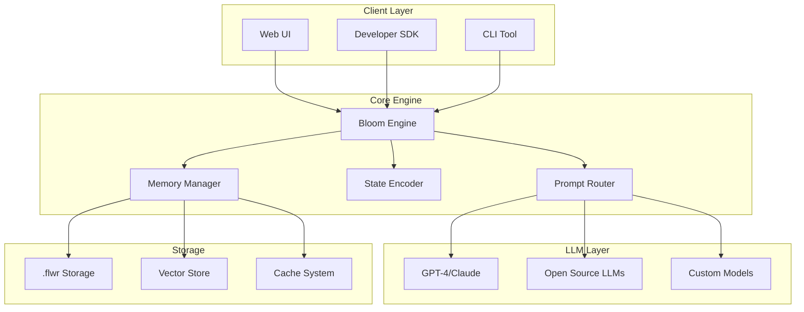

# flwr.la Architecture Overview

## System Architecture



## Core Components

### 1. Bloom Engine
The heart of flwr.la - manages the lifecycle of LLM modules.

```typescript
interface BloomEngine {
  seed(config: FlowerConfig): Promise<Flower>;
  bloom(flowerId: string): Promise<Flower>;
  tend(flower: Flower, input: string): Promise<Response>;
  wilt(flowerId: string): Promise<void>;
}
```

### 2. Flower Module Structure

Each `.flwr` file contains:

```json
{
  "id": "dream_maker",
  "version": "1.0",
  "metadata": {
    "created": "2025-06-13T10:00:00Z",
    "lastBloomed": "2025-06-13T14:30:00Z",
    "bloomCount": 7
  },
  "genome": {
    "baseModel": "gpt-4",
    "temperature": 0.9,
    "systemPrompt": "...",
    "traits": ["creative", "melancholic", "poetic"]
  },
  "memory": {
    "shortTerm": [],
    "longTerm": [],
    "episodic": []
  },
  "state": {
    "currentMood": "contemplative",
    "energyLevel": 0.7,
    "coherence": 0.9
  }
}
```

### 3. State Management

Flowers maintain three types of state:

1. **Ephemeral State**: Lives only during bloom session
2. **Persistent State**: Saved between sessions
3. **Evolutionary State**: Changes based on interactions

### 4. Memory Architecture

```typescript
interface FlowerMemory {
  // Short-term: Current session context
  shortTerm: MemoryFragment[];

  // Long-term: Key learnings and patterns
  longTerm: MemoryFragment[];

  // Episodic: Specific interaction memories
  episodic: Episode[];
}
```

### 5. Prompt Router

Intelligently routes requests to appropriate LLM providers based on:
- Flower configuration
- Task requirements
- Cost optimization
- Latency requirements

### 6. State Encoder

Transforms flower states into LLM-compatible formats:
- Encodes memories into embeddings
- Manages context windows
- Handles state transitions

## Data Flow

1. **Seeding Phase**
   ```
   User Config ¡æ Bloom Engine ¡æ New .flwr file
   ```

2. **Blooming Phase**
   ```
   .flwr file ¡æ State Decoder ¡æ LLM Context ¡æ Active Flower
   ```

3. **Interaction Phase**
   ```
   User Input ¡æ Active Flower ¡æ Prompt Router ¡æ LLM ¡æ Response
                      ¡é
                 State Update
   ```

4. **Wilting Phase**
   ```
   Active Flower ¡æ State Encoder ¡æ .flwr file update/deletion
   ```

## Security Considerations

- End-to-end encryption for sensitive memories
- User-controlled data retention
- Isolated flower environments
- API key management best practices

## Scalability Strategy

1. **Horizontal Scaling**: Multiple Bloom Engine instances
2. **Caching**: Intelligent response caching
3. **CDN**: Distributed .flwr file storage
4. **Queue System**: Async processing for heavy operations

## Integration Points

### LLM Providers
- OpenAI GPT-4/GPT-3.5
- Anthropic Claude
- Open source models (Llama, Mistral)
- Custom fine-tuned models

### Storage Backends
- Local filesystem
- S3-compatible storage
- IPFS for decentralized storage
- Vector databases (Pinecone, Weaviate)

### External Services
- Authentication providers
- Analytics platforms
- Monitoring systems
- Payment processing
