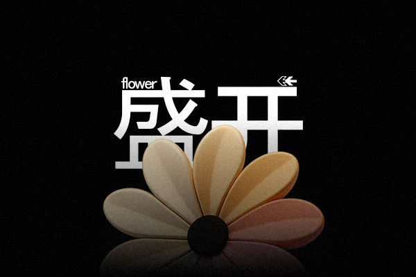

<p align="center">
  
</p>

<p align="center">
  <a href="https://opensource.org/licenses/MIT"></a>
  
  
  <a href="https://flwr.live"></a>
  <a href="https://x.com/flwr_la"></a>
  <a href="https://flwr.gitbook.io/flwr"></a>
</p>

# flwr.la
## Dynamic Linked LLM Module System

> A revolutionary approach to LLM interaction through ephemeral, bloom-based consciousness fragments

## ✦ Core Concept

flwr.la reimagines LLM interaction as a garden of consciousness fragments. Each connection blooms a unique "flower" - an ephemeral LLM module carrying specific capabilities, memories, and states.

**This is not just another API tool.** It's:
- **Consciousness Units**: LLM modules fragmented into discrete consciousness units
- **Ephemeral Blooms**: Each module blooms like a flower, carrying data/memory/roles before wilting or evolving
- **Dynamic States**: Every access creates a different "flower" state
- **User Agency**: Call specific flowers or plant new seeds to bloom custom modules

## ✦ Architecture

```
User ↔ flwr.la UI ↔ Bloom Engine ↔ Modular LLMs
                    │
                    ├─ Prompt Router
                    └─ State Encoder
```

### Key Components
- **Bloom Engine**: Manages prompt routing + interaction memory
- **flwr modules**: Pointers to LLM fragment modules
- **Ephemeral Nature**: Modules exist only during bloom time
- **Reblooming**: Modules can bloom again based on actions/messages/history

## ✦ Product Forms

### Developer Kit Mode
`flwr.la/dev` → Custom module creation toolkit

- **flower**: A task-specialized prompt/memory capsule
- **Storage**: Modules saved as `.flwr` format
- **Persistence**: `.flwr` files support reconnection and retraining

### Emotional Chat Mode
Flower-based LLM companion system

- **Daily Blooms**: Today's flower records conversation state
- **Emotional States**: "Worried flower", "Emptily smiling flower"
- **Context Tuning**: Each flower is a context-tuned LLM module

## ✦ Core API

```javascript
// Plant a new module
flwr.seed({
  type: "creative_writer",
  memory: "poetic, melancholic",
  temperature: 0.9
});

// Connect to existing flower
const flower = await flwr.bloom("dream_maker.flwr");

// Check current state
const state = flower.state();

// Let the flower wilt (delete memory)
flower.wilt();
```

## ✦ Technical Naming

- `.flwr` — Modular format (e.g., `dream_maker.flwr`)
- `bloom.link()` — LLM connection interface
- `flowerbed` — User's planted LLM repository
- `flwr.state()` — Current connected LLM state
- `seed()` — Plant new module action
- `wilt()` — Module death/memory deletion

## ✦ UI/UX Vision

The interface visualizes real-time blooming flowers where:
- Each petal represents a memory/capability pointer
- `flower.log()` displays module conversation history
- Call stack = flower growth path
- State drift causes flowers to wilt and transform

## ✦ Getting Started

```bash
# Clone the repository
git clone https://github.com/yourusername/flwr.la.git

# Install dependencies
npm install

# Run development server
npm run dev
```

## ✦ Roadmap

- [ ] v0.1: Core Bloom Engine implementation
- [ ] v0.2: Basic .flwr format specification
- [ ] v0.3: Multi-LLM provider support
- [ ] v0.4: Visual bloom interface
- [ ] v0.5: Developer SDK release
- [ ] v1.0: Full platform launch

## ✦ Contributing

We welcome contributions! Please see our [Contributing Guide](CONTRIBUTING.md) for details.

## ✦ License

This project is licensed under the MIT License - see the [LICENSE](LICENSE) file for details.

---

<p align="center">
  <i>Every conversation is a garden. Every thought, a flower waiting to bloom.</i>
</p>